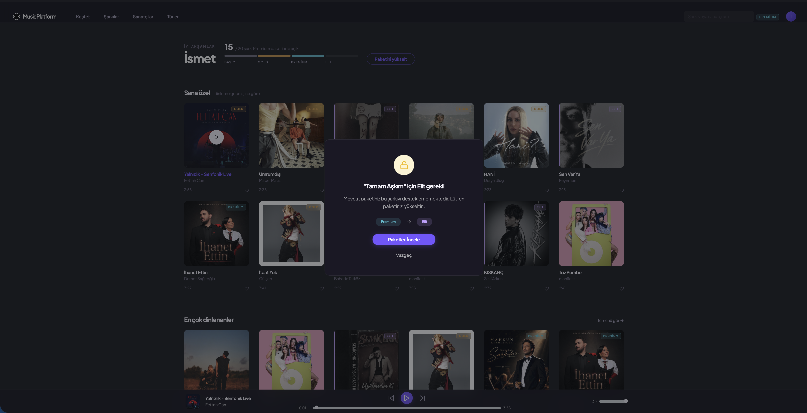
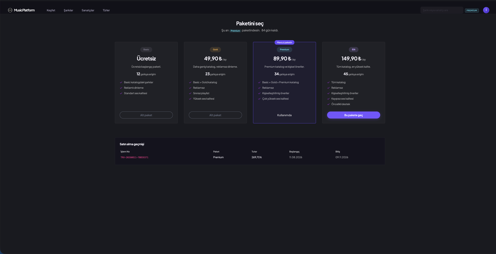
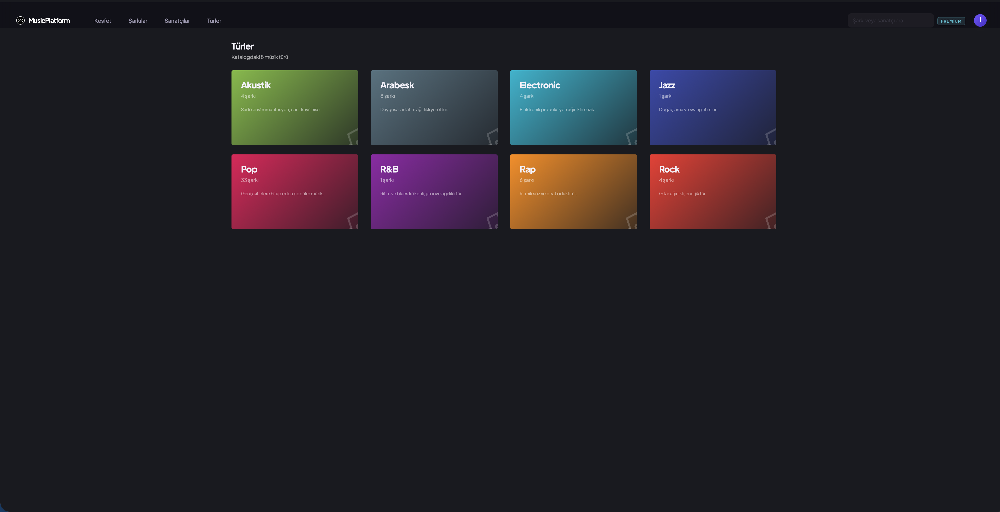

# MusicPlatform

JWT tabanlı, paket bazlı yetkilendirme yapan müzik dinleme platformu.

`ASP.NET Core 8` · `Entity Framework Core` · `SQL Server` · `Hangfire` · `ML.NET`

---

## Projenin odağı

Sistemde dört üyelik paketi var: **Basic → Gold → Premium → Elit**.
Her şarkı bir pakete ait; kullanıcı, şarkının gerektirdiği paket seviyesine
eşit veya üstündeyse dinleyebilir.

Bu hiyerarşi tek bir karşılaştırmaya indirgenmiştir:

```csharp
public bool CanAccess(PackageLevel userPackage, PackageLevel requiredPackage)
    => (int)userPackage >= (int)requiredPackage;
```

Kullanıcının paket bilgisi **JWT içinde bir claim olarak** taşınır:

```json
{
  "sub": "5",
  "email": "gold@music.com",
  "package": "2",
  "packageName": "Gold",
  "exp": 1786050000
}
```

Yetkisiz erişimde API **403 Forbidden** ve şu mesajı döner:

> Mevcut paketiniz bu şarkıyı desteklememektedir. Lütfen paketinizi yükseltin.

---

## Ekran görüntüleri

| | |
|---|---|
|  |  |
| Yetkisiz erişimde açılan uyarı — ses hiç başlamıyor | Katalog kilidi göstergesi ve kilitli kartlar |
|  |  |
| Paket kataloğu ve satın alma geçmişi | Tür bazlı gezinme |

> Görselleri `docs/img/` klasörüne bu adlarla koyun, tablo kendiliğinden dolar.

---

## Mimari

```
MusicPlatform.sln
├── MusicPlatform.Entity     Entity'ler, enum'lar, Identity sınıfları
├── MusicPlatform.DAL        DbContext, Fluent API, migration, seed
├── MusicPlatform.Business   Servisler, JWT üretimi, mail, öneri motoru
├── MusicPlatform.Shared     DTO'lar (API ve UI ortak kullanır)
├── MusicPlatform.API        Controller'lar, JwtBearer, Swagger, Hangfire
└── MusicPlatform.UI         MVC arayüzü, HttpClient ile API tüketimi
```

**UI, Business katmanını referans almaz.** Sadece `Shared` içindeki DTO'ları
bilir, veriye yalnızca HTTP üzerinden ulaşır. Bu sayede iki katmanlı yapı
kâğıt üstünde değil, gerçekten uygulanmıştır.

### Güvenlik kararları

| Karar | Gerekçe |
|---|---|
| MP3'ler `App_Data/Music`'te, `wwwroot`'ta değil | `wwwroot`'ta olsalardı Network sekmesinden URL kopyalanıp paket kontrolü atlanabilirdi |
| Paket kontrolü hem `check` hem `stream` ucunda | İstemcinin nazik davranmasına güvenilmiyor |
| Token hem claim'den hem DB'den doğrulanıyor | Token 15 dk geçerli; o sürede paket süresi dolmuş olabilir |
| Access token 15 dk, refresh token 7 gün | JWT stateless olduğu için iptal edilemez; kısa ömür zararı sınırlar |
| Refresh token rotation + hırsızlık tespiti | Kullanılmış token tekrar gelirse tüm oturumlar kapatılır |
| Token'lar `HttpOnly` cookie'de | `localStorage` XSS ile okunabilir |
| Login'de "e-posta mı şifre mi yanlış" denmiyor | User enumeration koruması |
| Avatar dosya adı sunucuda üretiliyor | Path traversal koruması |
| Playlist sorgularında `UserId` şartı | IDOR koruması |
| Login ucunda IP başına 10 istek/dk | Brute-force koruması (Identity lockout'a ek olarak) |

### `<audio>` elementi ve token sorunu

`<audio src="...">` HTTP header gönderemez, dolayısıyla `Authorization: Bearer`
ekleyemez. Token'ı URL'e koymak da kötü (log, geçmiş, referer sızıntısı).

Çözüm: **UI proxy.**

```
<audio src="/Stream/Play/12">
        │  (HttpOnly cookie otomatik gider)
        ▼
UI · StreamController.Play(12)
        │  cookie'den token okunur, Bearer header'ı eklenir
        │  Range header'ı aynen aktarılır
        ▼
API · GET /api/stream/12  →  paket kontrolü  →  FileStreamResult
        │
        ▼
tarayıcıya pipe edilir (206 Partial Content destekli)
```

Güvenlik API'de kalır, UI yalnızca taşıyıcıdır.

---

## Kurulum

### Gereksinimler

- .NET 8 SDK
- Docker (SQL Server için) veya yerel SQL Server

### 1. Veritabanı

```bash
docker run -d \
  --name musicplatform-sql \
  -e "ACCEPT_EULA=Y" \
  -e "MSSQL_SA_PASSWORD=Passw0rd!2026" \
  -p 1433:1433 \
  -v musicplatform-sqldata:/var/opt/mssql \
  --restart unless-stopped \
  mcr.microsoft.com/mssql/server:2022-latest
```

> Apple Silicon Mac'te `mcr.microsoft.com/azure-sql-edge:latest` kullanın.

### 2. Ayar dosyası

`MusicPlatform.API/appsettings.Development.example.json` dosyasını
`appsettings.Development.json` adıyla kopyalayın ve doldurun:

- **ConnectionStrings** — SQL Server bağlantısı
- **Jwt:SecretKey** — en az 32 karakter (HMAC-SHA256 gereği)
- **Mail** — Gmail için [uygulama şifresi](https://myaccount.google.com/apppasswords)
  gerekir; normal hesap şifresi çalışmaz. Mail göndermeden test etmek için
  `"DevelopmentMode": true` yapın, mailler konsola yazılır.

### 3. MP3 dosyaları

Telifli oldukları için repoya dahil edilmemiştir.
MP3 dosyalarını `MusicPlatform.API/App_Data/Music/` klasörüne koyun.

Seeder dosyaları tarar ve **ID3 etiketlerinden** şarkı adı, sanatçı, albüm,
süre ve gömülü kapak görselini otomatik çıkarır. Elle veri girmeye gerek yoktur.
Şarkılar dört pakete sırayla dağıtılır.

Dosya adlarında `|`, `/`, `\` gibi karakterler bulunmamalıdır.

### 4. Çalıştırma

```bash
dotnet run --project MusicPlatform.API   # http://localhost:5014
dotnet run --project MusicPlatform.UI    # https://localhost:7001
```

İlk açılışta migration'lar uygulanır, seed verisi yüklenir ve
geliştirme ortamında öneri motoru için demo kullanıcılar üretilir.

| Adres | İçerik |
|---|---|
| `http://localhost:5014/swagger` | API dokümantasyonu |
| `http://localhost:5014/hangfire` | Zamanlanmış işler panosu |
| `https://localhost:7001` | Kullanıcı arayüzü |

---

## Test kullanıcıları

| E-posta | Şifre | Paket | Erişim |
|---|---|---|---|
| `basic@music.com` | `Test123!` | Basic | Yalnızca Basic |
| `gold@music.com` | `Test123!` | Gold | Basic + Gold |
| `premium@music.com` | `Test123!` | Premium | Basic + Gold + Premium |
| `elit@music.com` | `Test123!` | Elit | Tümü |

Öneri motorunu test etmek için demo kullanıcılar (`Demo123!`):
`rapci3@demo.local`, `popcu5@demo.local`, `arabeskci7@demo.local` …

Her profilin dinleme alışkanlığı farklıdır; aynı endpoint farklı kullanıcıda
farklı öneriler döndürür.

**Test kartı** (Luhn geçerli): `4242 4242 4242 4242`

---

## Postman

`postman/` klasöründeki iki dosyayı Postman'e import edin:

- `MusicPlatform.postman_collection.json` — 12 klasör, 67 istek
- `MusicPlatform.postman_environment.json` — ortam değişkenleri

Environment'ı seçtikten sonra herhangi bir **Login** isteğini çalıştırmanız
yeterlidir; token otomatik kaydedilir ve diğer isteklerde kullanılır.

İki klasör senaryo olarak tasarlanmıştır, **Run folder** ile sırayla çalıştırın:

**02 — Paket Yetkilendirme**
Basic giriş → şarkı listesi → izinli şarkı 200 → Elit şarkı 403 →
doğrudan stream'e erişim yine 403 → Elit giriş → aynı şarkı 200 → token'sız 401

**11 — Paket Yükseltme**
Basic giriş → Elit şarkı 403 → ödeme → aynı şarkı **hâlâ 403** →
token yenile → aynı şarkı 200

İkinci senaryodaki "hâlâ 403" adımı bir hata değil, JWT'nin stateless
doğasının göstergesidir: token üretildiği andaki paket bilgisini taşır,
sunucu onu geriye dönük değiştiremez.

---

## Öneri motoru

Dört kademeli, boş sonuç dönmeyecek şekilde tasarlanmıştır:

1. **Co-occurrence** — "Bu şarkıyı dinleyenlerin %64'ü şunu da dinledi"
2. **User-based collaborative filtering** — benzer zevkli kullanıcıların
   dinleyip sizin dinlemediğiniz şarkılar, benzerlik ağırlıklı oylamayla
3. **Tür bazlı** — en çok dinlediğiniz türlerden popüler şarkılar
4. **Cold start** — geçmişi olmayan kullanıcı için her türden birer popüler şarkı

30 saniyeden kısa dinlemeler "beğeni sinyali" sayılmaz; bir öneri için
en az iki farklı kullanıcıda tekrarlanan örüntü aranır.

**ML.NET** (`MatrixFactorizationTrainer`) opsiyonel bir katman olarak eklenmiştir.
200 kayıttan az veri varsa model eğitilmez ve sistem co-occurrence ile çalışmaya
devam eder — küçük veri setinde matrix factorization anlamsız sonuç ürettiği için.

---

## Mail bildirimleri

MailKit + Hangfire. Tüm gönderimler `EmailLogs` tablosuna kaydedilir.

| Şablon | Tetikleyici |
|---|---|
| Welcome | Kayıt (e-posta doğrulama bağlantısıyla) |
| PasswordReset | Şifremi unuttum |
| PasswordChanged | Şifre değişikliği |
| PurchaseReceipt | Paket satın alma |
| UpgradeInvitation | 403 alındığında (24 saatte bir) |
| NewDeviceLogin | Yeni cihazdan giriş |
| PackageExpiring | Zamanlanmış: her gün 09:00 |
| WeeklyRecommendations | Zamanlanmış: pazartesi 10:00 |

---

## Muhtemel sorular

**"Kullanıcı token'ı manipüle edip `package` claim'ini 4 yapsa?"**
İmza tutmaz, 401 alır. JWT'nin üçüncü parçası, header + payload'ın gizli
anahtarla üretilmiş HMAC-SHA256 imzasıdır. Payload değişirse imza doğrulanmaz.
Ayrıca stream ucunda paket DB'den de kontrol edilir.

**"MP3 URL'ini kopyalayıp doğrudan açsa?"**
`/api/stream/12` `[Authorize]` korumalıdır, token'sız 401 döner. Token varsa
da paket kontrolünden geçmesi gerekir. Dosyalar `wwwroot` dışındadır,
statik olarak servis edilmezler.

**"Paket yükseltince neden hemen erişemiyor?"**
JWT stateless'tır; token üretildiği andaki bilgiyi taşır. Bu yüzden access
token ömrü 15 dakikada tutulmuş ve yükseltme sonrası otomatik refresh
tetiklenmiştir. `PurchaseResultDto.RequiresTokenRefresh` alanı UI'ı uyarır.

**"Neden Redis / mikroservis / CQRS yok?"**
Bu ölçekte fayda sağlamayacak karmaşıklıklar. Tek DB, tek uygulama sunucusu
ve sınırlı bir katalog için N-Layer + EF Core doğru ölçek.

---

## Kullanılan teknolojiler

**Backend:** ASP.NET Core 8, Entity Framework Core, ASP.NET Identity,
JWT Bearer, Hangfire, MailKit, ML.NET, Serilog, TagLibSharp

**Frontend:** ASP.NET Core MVC, Bootstrap, vanilla JS player

**Veritabanı:** SQL Server (Docker), Code First migration
